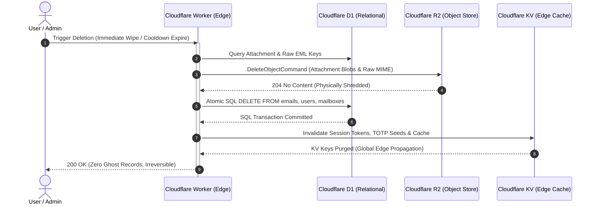

  
EPOCANVAS MAIL PRIVACY POLICY

  

    <strong>生效日期 (Effective Date)</strong>: 2026 年 10 月 10 日 | <strong>最后更新 (Last Updated)</strong>: 2026 年 10 月 10 日 
    <strong>适用实体 (Entity)</strong>: EpoCanvas Inc. ("we", "us", or "our") 
    <strong>服务范围 (Scope)</strong>: <a href="https://mail.epocanvas.com" target="_blank" rel="noopener">https://mail.epocanvas.com</a>, 移动客户端应用 (EpoMail App), 以及所有关联的边缘 API 服务。
  

:::note[自主托管与私有化部署法律定位免责声明 (Self-Hosted Instance Disclaimer)]
**若您正在访问由第三方组织或个人独立部署的私有/开源 EpoMail 实例**：  
部署并运营该独立域名的组织或个人是您专属且唯一的**数据控制者 (Data Controller)**。本《隐私权政策》仅作为 EpoCanvas 官方托管服务 (`mail.epocanvas.com`) 的运营合规指引与底层开源代码的功能技术基线说明。EpoCanvas Inc. 及其代码维护者**不拥有、不运营该独立实例，不上报任何遥测数据，且在物理与技术上完全无法访问该实例中的任何邮件或用户通信**。
:::

> 💡 **技术规范交叉索引 (Technical Baseline Reference)**  
> 本隐私政策与专案底层技术架构严格对齐。关于云原生分布式边缘网络架构、密码学多租户隔离、毫秒级级联销毁算法以及 2% 强制预留容量保护机制，请同步参阅 [《合规技术基线与功能规范 (Technical Baseline Specification v1.0.0)》](/legal/technical-baseline/)。

---

This Privacy Notice for **EpoCanvas Inc.** ("**we**," "**us**," or "**our**"), describes how and why we might access, collect, store, use, and/or share ("**process**") your personal information when you use our services ("**Services**"), including when you:

* Visit our website at [https://mail.epocanvas.com](https://mail.epocanvas.com) or any website of ours that links to this Privacy Notice;
* Download and use our mobile application (**epomail**), or any other application of ours that links to this Privacy Notice;
* Use **epomail** for private email routing, mailbox management, attachment storage, and automated edge notification services;
* Engage with us in other related ways, including customer support, developer community activities, or compliance verification.

**Questions or concerns?** Reading this Privacy Notice will help you understand your privacy rights and choices. If you do not agree with our policies and practices, please do not use our Services. If you still have any questions or concerns, please contact us at [privacy@epocanvas.com](mailto:privacy@epocanvas.com).

---

## 📌 SUMMARY OF KEY POINTS

*This summary provides key points from our Privacy Notice, but you can find out more details about any of these topics by clicking the link following each key point or by using our [Table of Contents](#toc) below.*

* **What personal information do we process?** When you visit, use, or navigate our Services, we may process personal information depending on how you interact with us and the Services, the choices you make, and the products and features you use. Learn more about [personal information you disclose to us](#personalinfo).
* **Do we process any sensitive personal information?** Some of the information may be considered "special" or "sensitive" in certain jurisdictions, for example your racial or ethnic origins, sexual orientation, and religious beliefs. **We do not process sensitive personal information.**
* **Do we collect any information from third parties?** We do not collect any information from third-party data brokers or marketing aggregators.
* **How do we process your information?** We process your information to provide, improve, and administer our Services, communicate with you, for security and fraud prevention, and to comply with law. We may also process your information for other purposes with your consent. We process your information only when we have a valid legal reason to do so. Learn more about [how we process your information](#infouse).
* **In what situations and with which parties do we share personal information?** We may share information in specific situations and with vetted technical infrastructure sub-processors (such as Cloudflare edge infrastructure). Learn more about [when and with whom we share your personal information](#whoshare).
* **How do we keep your information safe?** We have adequate organizational and technical processes and procedures in place to protect your personal information, including end-to-end TLS 1.3 transit encryption, AES-GCM credential encryption at rest, and fail-closed RBAC access control. However, no electronic transmission over the internet or storage technology can be guaranteed to be 100% secure. Learn more about [how we keep your information safe](#infosafe).
* **What are your rights?** Depending on where you are located geographically, applicable privacy laws (such as EU/UK GDPR, CCPA/CPRA, etc.) mean you have specific rights regarding your personal information. Learn more about [your privacy rights](#privacyrights).
* **How do you exercise your rights?** The easiest way to exercise your rights is by visiting your account settings dashboard or by emailing [privacy@epocanvas.com](mailto:privacy@epocanvas.com). We will consider and act upon any request in accordance with applicable data protection laws.

  

---

## 📑 TABLE OF CONTENTS

1. [WHAT INFORMATION DO WE COLLECT?](#infocollect)
2. [HOW DO WE PROCESS YOUR INFORMATION?](#infouse)
3. [WHAT LEGAL BASES DO WE RELY ON TO PROCESS YOUR PERSONAL INFORMATION?](#legalbases)
4. [WHEN AND WITH WHOM DO WE SHARE YOUR PERSONAL INFORMATION?](#whoshare)
5. [DO WE USE COOKIES AND OTHER TRACKING TECHNOLOGIES?](#cookies)
6. [DO WE OFFER ARTIFICIAL INTELLIGENCE-BASED PRODUCTS?](#ai)
7. [HOW DO WE HANDLE YOUR SOCIAL LOGINS?](#sociallogins)
8. [HOW LONG DO WE KEEP YOUR INFORMATION?](#inforetain)
9. [HOW DO WE KEEP YOUR INFORMATION SAFE?](#infosafe)
10. [DO WE COLLECT INFORMATION FROM MINORS?](#infominors)
11. [WHAT ARE YOUR PRIVACY RIGHTS?](#privacyrights)
12. [CONTROLS FOR DO-NOT-TRACK FEATURES](#DNT)
13. [DO UNITED STATES RESIDENTS HAVE SPECIFIC PRIVACY RIGHTS?](#uslaws)
14. [DO OTHER REGIONS HAVE SPECIFIC PRIVACY RIGHTS?](#otherlaws)
15. [EDGE-CONFINED AI INFERENCE AND MODEL TRAINING EXCLUSION](#clausea)
16. [CASCADING PHYSICAL ERASURE AND RIGHT TO BE FORGOTTEN](#clauseb)
17. [STORAGE CAPACITY GOVERNANCE AND AUTOMATED SAFEGUARDS](#clausec)
18. [DO WE MAKE UPDATES TO THIS NOTICE?](#policyupdates)
19. [HOW CAN YOU CONTACT US ABOUT THIS NOTICE?](#contact)
20. [HOW CAN YOU REVIEW, UPDATE, OR DELETE THE DATA WE COLLECT FROM YOU?](#request)

---

### 1. WHAT INFORMATION DO WE COLLECT?

#### Personal information you disclose to us

**In Short:** *We collect personal information that you voluntarily provide to us.*

We collect personal information that you voluntarily provide to us when you register on the Services, express an interest in obtaining information about us or our products and Services, when you participate in activities on the Services, or otherwise when you contact us.

* **Personal Information Provided by You:** The personal information that we collect depends on the context of your interactions with us and the Services, the choices you make, and the products and features you use. The personal information we collect may include:
  * **Email Communications & Metadata:** Inbound and outbound email contents, subject lines, recipient addresses, sender headers, MIME structures, and user-uploaded file attachments.
  * **Identity & Account Records:** Real names or pseudonyms, usernames, contact preferences, and salted PBKDF2-hashed passwords.
  * **Authentication & Recovery Data:** Secondary recovery email addresses, phone numbers (if optionally configured for SMS/2FA), and AES-GCM encrypted TOTP secret seeds.
  * **Configuration Data:** Contact address books, mail routing rules, custom tags, webhook subscription URLs, and notification tokens.
* **Sensitive Information:** **We do not process sensitive information** (such as racial or ethnic origin, political opinions, religious or philosophical beliefs, trade union membership, genetic data, or biometric data for identification).
* **Payment Data:** We may collect data necessary to process your payment if you choose to make sponsorship donations or purchases. All sponsorship payment data is securely handled and processed by **GitHub (GitHub Sponsors)** or designated payment processors. You may review their privacy policy at [https://blog.epocanvas.com/support/](https://blog.epocanvas.com/support/).
* **Social Media Login Data:** We may provide you with the option to register or authenticate using your existing social media account details (e.g., GitHub, Google). Where you choose to do this, we collect the necessary authentication tokens and profile identifiers as described in [HOW DO WE HANDLE YOUR SOCIAL LOGINS?](#sociallogins).
* **Application Data:** If you use our mobile or desktop application(s), we may collect the following information with your explicit permission:
  * *Geolocation Information:* We may request access to coarse, network-derived geolocation data to detect suspicious cross-border logins and protect your account.
  * *Mobile Device Access:* We may request permission to access your device's local storage (to save downloaded email attachments) and notifications (to alert you of incoming messages).
  * *Push Notifications:* We may send background push notifications regarding incoming mail or security alerts. You may disable these permissions at any time in your device settings.

All personal information that you provide to us must be true, complete, and accurate, and you must notify us of any changes to such personal information.

#### Information automatically collected

**In Short:** *Some information — such as your Internet Protocol (IP) address, browser, and device characteristics — is collected automatically when you visit our Services.*

We automatically collect certain technical information when you visit, use, or navigate the Services:

* **Log and Usage Data:** Server diagnostic, usage, and performance logs automatically generated when you access the edge gateway. This data includes your IP address, browser type and version, language preferences, operating system, referring URLs, request timestamps, and system activity logs.
* **Device Data:** Technical information regarding your computer, phone, tablet, or client software, including operating system release, user agent strings, and network provider identifiers.
* **Location Data:** Imprecise location data derived from your IP address by the Cloudflare edge network, utilized to connect you to the nearest data center and safeguard against session hijacking.
* **Security and Rate-Limiting Telemetry:** Temporary login failure counters, IP lockout timestamps, and sliding-window request tallies stored in edge memory (Cloudflare KV) to prevent credential stuffing and brute-force abuse.
* **Google API Compliance:** Our use of information received from Google APIs will strictly adhere to the [Google API Services User Data Policy](https://developers.google.com/terms/api-services-user-data-policy), including the **Limited Use requirements**.

---

### 2. HOW DO WE PROCESS YOUR INFORMATION?

**In Short:** *We process your information to provide, improve, and administer our Services, communicate with you, ensure security and fraud prevention, and comply with law.*

We process your personal information for a variety of legitimate operational reasons:

1. **To facilitate account creation, authentication, and user management:** To provision your mailbox addresses, verify credentials, issue signed session JWTs, and maintain account state.
2. **To deliver email communication services:** To execute inbound MX reception, SPF/DKIM/DMARC verification, MIME stream parsing, attachment storage, and outbound SMTP delivery.
3. **To protect our Services and users:** To prevent brute-force attacks, detect spam floods, block unauthorized access attempts, and audit administrative actions.
4. **To perform edge-confined feature enhancements:** To extract one-time passcodes (OTP) and verification numbers locally on edge inference nodes without exposing raw messages to external AI providers.
5. **To request feedback and user support:** To troubleshoot reported issues, answer support inquiries, and notify you of critical system updates.
6. **To comply with legal obligations:** To respond to lawful subpoenas, court orders, or statutory compliance obligations.

---

### 3. WHAT LEGAL BASES DO WE RELY ON TO PROCESS YOUR PERSONAL INFORMATION?

**In Short:** *We only process your personal information when we have a valid legal basis under applicable law (such as GDPR, UK GDPR, or PIPEDA).*

#### For Individuals Located in the European Economic Area (EEA) or United Kingdom (UK)

Under the General Data Protection Regulation (GDPR) and UK GDPR, we rely on the following lawful bases:

* **Performance of a Contract (Article 6(1)(b) GDPR):** Processing is necessary to provide the email communication services you requested under our [Terms of Service](/legal/terms/).
* **Legitimate Interests (Article 6(1)(f) GDPR):** Processing is necessary for our legitimate interests, provided they do not override your fundamental rights:
  * Maintaining edge network security, fraud prevention, and rate-limiting integrity;
  * Diagnosing platform crashes and optimizing edge runtime latency;
  * Protecting intellectual property and preventing service abuse.
* **Compliance with Legal Obligations (Article 6(1)(c) GDPR):** Processing is necessary to fulfill statutory tax, accounting, or judicial cooperation duties.
* **Consent (Article 6(1)(a) GDPR):** Where we specifically request your consent (e.g., optional third-party integrations or marketing communications). You have the right to withdraw your consent at any time.

#### For Individuals Located in Canada

We process your information based on express or implied consent under the **Personal Information Protection and Electronic Documents Act (PIPEDA)**. You may withdraw consent at any time. In specific exceptional cases permitted by law, data may be processed without consent (such as for investigations of fraud, legal claims, or responding to court subpoenas).

---

### 4. WHEN AND WITH WHOM DO WE SHARE YOUR PERSONAL INFORMATION?

**In Short:** *We do not sell your personal data. We only share information with vetted infrastructure sub-processors or under legal compulsion.*

We strictly limit information disclosure to the following authorized scenarios:

* **Infrastructure Sub-Processors:** We partner with tier-one cloud providers to run our edge-native stack:
  * **Cloudflare, Inc.:** Provides globally distributed serverless compute (Workers), relational edge storage (D1), object storage for attachments (R2), and ephemeral caching (KV). Data processing complies with ISO 27001, SOC 2 Type II, and EU Standard Contractual Clauses (SCCs).
  * **Outbound Delivery Relays (e.g., Resend / Cloudflare Email Routing):** Responsible for transmitting outbound emails to external internet recipient mail servers via encrypted TLS channels.
* **Business Transfers:** If EpoCanvas Inc. enters into a merger, asset sale, or reorganization, user data may be transferred subject to binding confidentiality agreements preserving this Privacy Notice.
* **Legal Compliance & Protection:** We may disclose data if required by law, subpoena, or to protect the safety of users or the public (see our [司法调证与合规协助指引](/legal/law-enforcement/)).

---

### 5. DO WE USE COOKIES AND OTHER TRACKING TECHNOLOGIES?

**In Short:** *We use strictly necessary session cookies and tokens. We do not use third-party behavioral advertising cookies.*

* **Strictly Necessary Storage:** We use local session storage and secure HTTP-only cookies solely for user authentication (JWT session tokens), CSRF defense, and interface preference retention (e.g., Dark Mode, language locale).
* **Zero Third-Party Advertising Trackers:** We **do not embed** Google Analytics, Meta Pixel, or any commercial advertising tracking scripts into our webmail interface.
* **Cookie Governance:** For further details on local storage mechanics, please consult our dedicated [Cookie Policy](https://docs.epocanvas.com/cookie).

---

### 6. DO WE OFFER ARTIFICIAL INTELLIGENCE-BASED PRODUCTS?

**In Short:** *We offer edge-confined AI features (such as verification code extraction) built with strict privacy boundaries.*

As part of our Services, we offer intelligent productivity features powered by edge machine learning technologies:

* **Edge-Confined AI Execution:** Intelligent parsing features (such as automated extraction of verification codes and OTPs from inbound registration emails) are executed **exclusively on Cloudflare Workers AI edge inference hardware**.
* **Zero External Public LLM Dispatch:** Your private email contents, MIME bodies, and attachments are **never transmitted** to external commercial AI platforms (e.g., OpenAI, Google Gemini, or Anthropic public APIs).
* **Zero Model Training:** User communication data is strictly segregated and **never utilized to train, fine-tune, or calibrate** any public or private artificial intelligence models.
* **User Opt-Out:** You retain full autonomy to disable automated AI text extraction at any time in your account settings.

---

### 7. HOW DO WE HANDLE YOUR SOCIAL LOGINS?

**In Short:** *If you choose to log in using third-party social accounts (such as GitHub), we only access the minimum authentication profile.*

Our Services offer you the ability to authenticate using select third-party identity providers (OAuth 2.0). Where you choose this option:
* We receive profile identifiers such as your verified email address, username, and public avatar URL from the provider.
* We use this information solely for account creation, binding, and identity verification.
* We do not gain access to your private third-party social media feeds, contacts, or internal private records.

---

### 8. HOW LONG DO WE KEEP YOUR INFORMATION?

**In Short:** *We retain data only as long as necessary for service delivery, user-directed deletion triggers cascading physical destruction, and no records are kept longer than statutory maximums.*

* **Active Mailbox Accounts:** User emails, MIME headers, contact lists, and attachments are retained exclusively during the active lifecycle of your account.
* **Cascading Physical Wipeout on Termination:** Following an account closure or deletion request, an automated multi-tier physical wipeout is executed across Cloudflare D1 (database records) and Cloudflare R2 (attachment blobs) with zero soft-delete holding. Users may configure an optional **7-day anti-accidental deletion cooling-off buffer** or execute an immediate force-purge.
* **Security & Diagnostic Telemetry:** Non-content security audit logs (such as login failure counts, IP rate-limit blocks, and Turnstile challenges) rotate automatically on a rolling **90-day** window to safeguard against systemic cyberattacks.
* **Statutory Compliance Ceiling:** In the event of ongoing legal dispute, fraud investigation, or tax accounting compliance, non-communication administrative transaction logs may be retained up to a statutory maximum ceiling of **six (6) months** post-termination, after which they are irreversibly destroyed. (See our detailed [数据保留与彻底删除准则](/legal/data-retention/)).

---

### 9. HOW DO WE KEEP YOUR INFORMATION SAFE?

**In Short:** *We protect your personal information through enterprise-grade technical and organizational security controls.*

* **Transit Encryption:** Mandatory HTTPS / TLS 1.3 encryption across all public web and API endpoints, with HSTS preload enforcement.
* **Storage Encryption at Rest:** Cloudflare R2 object storage and D1 relational databases utilize AES-256 encryption at rest. TOTP secrets are encrypted via AES-GCM prior to database persistence.
* **Access Control & RBAC:** Strict Role-Based Access Control enforcing default-deny fail-closed boundaries across all administrative and user operations.
* **Anti-Brute Force Protection:** Distributed rate-limiting powered by Cloudflare KV and Turnstile CAPTCHA integration to defeat automated credential stuffing.

---

### 10. DO WE COLLECT INFORMATION FROM MINORS?

**In Short:** *We do not knowingly collect data from or market to minors under 18 years of age.*

**Epocanvas Mail is strictly intended for individuals who are at least 18 years of age** or the age of legal majority in their jurisdiction. We do not knowingly solicit, collect, or process personal data from anyone under the age of 18. If we become aware that an account has been registered by a minor under 18, we reserve the right to immediately terminate the account and permanently purge all associated emails, credentials, and stored assets.

---

### 11. WHAT ARE YOUR PRIVACY RIGHTS?

**In Short:** *You have enforceable statutory privacy rights, including the right to access, rectify, export, and permanently delete your data.*

Depending on your geographical location (EEA, UK, Switzerland, Canada, or US states), you possess comprehensive legal rights:

* **Right of Access (Article 15 GDPR):** Request confirmation of whether we process your data and receive an export of your personal information.
* **Right to Rectification (Article 16 GDPR):** Correct inaccurate or incomplete account details.
* **Right to Erasure / Right to be Forgotten (Article 17 GDPR):** Request the immediate cascading physical deletion of your account, mailboxes, messages, and attachments.
* **Right to Restriction of Processing (Article 18 GDPR):** Restrict processing under specific contested conditions.
* **Right to Data Portability (Article 20 GDPR):** Export your mailbox records in standard, open formats (EML / JSON / Zip).
* **Right to Object (Article 21 GDPR):** Object to processing based on legitimate interests.
* **Right to Withdraw Consent:** Where processing is based on consent, you may withdraw it at any time without retroactive impact.

#### UK and European Supervisory Authorities

If you reside in the UK and are dissatisfied with our response, you may lodge a complaint with the **Information Commissioner's Office (ICO)**:
* **Website:** [ico.org.uk/make-a-complaint](https://ico.org.uk/make-a-complaint)
* **Helpline:** 0303 123 1113
* **Address:** Information Commissioner's Office, Wycliffe House, Water Lane, Wilmslow, Cheshire, SK9 5AF

If you reside in the EEA, you may contact your local [Member State Data Protection Authority](https://edpb.europa.eu/about-edpb/about-edpb/members_en). If in Switzerland, contact the [Federal Data Protection and Information Commissioner (FDPIC)](https://www.edoeb.admin.ch/).

---

### 12. CONTROLS FOR DO-NOT-TRACK FEATURES

Most web browsers and some mobile operating systems include a Do-Not-Track ("DNT") signal. At this time, no uniform technical standard for recognizing DNT signals has been adopted, and our Services do not alter behavior based on general DNT headers.

**Global Privacy Control (GPC):**  
We proudly recognize and honor **Global Privacy Control (GPC)** signals. If your browser broadcasts a valid GPC signal, we treat this as a legally binding opt-out signal under applicable state laws (including CCPA/CPRA). Because EpoCanvas Mail never sells or shares personal data for cross-context behavioral advertising, GPC preferences are naturally satisfied by design.

---

### 13. DO UNITED STATES RESIDENTS HAVE SPECIFIC PRIVACY RIGHTS?

**In Short:** *Residents of California, Virginia, Colorado, Connecticut, Utah, and other US states have specific statutory privacy rights under comprehensive state laws.*

#### Categories of Personal Information Collected (Past 12 Months)

| Category | Statutory Definition & Examples | Collected | Retention Period |
| :--- | :--- | :--- | :--- |
| **A. Identifiers** | Real name, alias, postal address, IP address, email address, account name | **YES** | Duration of active account + max 6 months post-termination |
| **B. Personal Records (Cal. Civ. Code § 1798.80(e))** | Name, contact telephone, employment credentials | **NO** | N/A |
| **C. Protected Classifications** | Race, religion, gender, age, national origin | **NO** | N/A |
| **D. Commercial Information** | Records of products purchased or sponsorship transaction history | **YES** | Up to 7 years for statutory tax/accounting records |
| **E. Biometric Information** | Fingerprints, voiceprints, facial scans | **NO** | N/A |
| **F. Internet / Network Activity** | Access logs, browser type, interaction timestamps with edge gateway | **YES** | 30 to 90 days rolling edge retention |
| **G. Geolocation Data** | Device location (coarse IP-derived city/country) | **YES** | Ephemeral / session duration |
| **H. Sensory Data** | Audio recordings, video meetings | **NO** | N/A |
| **I. Professional Information** | Resumes, employment history | **NO** | N/A |
| **J. Education Information** | Non-public student education records | **NO** | N/A |
| **K. Inferences** | User preference tags, categorization of system telemetry | **YES** | Max 6 months |
| **L. Sensitive Personal Information** | Social Security numbers, precise geolocation, financial credentials | **NO** | N/A |

#### Core US Consumer Rights
* **Right to Know and Access:** Request disclosure of the categories and specific pieces of personal information collected.
* **Right to Delete:** Request deletion of personal information subject to legal exceptions.
* **Right to Correct:** Request correction of inaccurate personal information.
* **Right to Opt-Out of Sale or Sharing:** EpoCanvas Mail **does not sell or share** your personal data for cross-context behavioral advertising.
* **Right to Non-Discrimination:** We will never deny services, charge different prices, or provide a lower quality of service for exercising your privacy rights.

#### California "Shine the Light" Law
California Civil Code Section 1798.83 permits California residents to request information regarding disclosure of personal information to third parties for their direct marketing purposes. EpoCanvas Mail never discloses personal data to third parties for direct marketing.

---

### 14. DO OTHER REGIONS HAVE SPECIFIC PRIVACY RIGHTS?

**In Short:** *We extend comprehensive privacy safeguards to users in Australia, New Zealand, South Africa, and across the globe.*

* **Australia & New Zealand:** We comply with the **Privacy Act 1988 (Cth)**, the Australian Privacy Principles (APPs), and the **New Zealand Privacy Act 2020**. Users may request access to, or correction of, personal information held by contacting our Data Protection Officer, or lodge complaints with the Office of the Australian Information Commissioner (OAIC).
* **Republic of South Africa:** We adhere to the **Protection of Personal Information Act (POPIA)**. Data subjects hold statutory rights to access, object, and demand correction or deletion of personal records.
* **Global Privacy Parity:** EpoCanvas Mail applies uniform, high-standard data sovereignty principles across all jurisdictions, ensuring equal privacy protection regardless of geographical boundaries.

---

### 15. EDGE-CONFINED AI INFERENCE AND MODEL TRAINING EXCLUSION

:::tip[合规技术专章 A：边缘 AI 推理与模型训练排除条款]
**本条款为 EpoCanvas Mail 针对现代人工智能合规的核心承诺，直接与系统架构代码绑定。**
:::

  

1. **Edge-Confined In-Memory Execution (边缘内存即时推理):**  
   All artificial intelligence and natural language processing capabilities provided within the Platform—including but not limited to the automatic extraction of One-Time Passcodes (OTP), verification numbers, and subject semantic tagging—are executed **strictly on Cloudflare Workers AI edge inference nodes**. Tokenization and inference occur in ephemeral memory buffers and are immediately discarded upon HTTP response completion.
2. **Zero Third-Party Public LLM Transmission (零公有 LLM 外传):**  
   User email messages, RFC 822 MIME headers, message bodies, and attachments are **strictly forbidden** from being transmitted, forwarded, cached, or mirrored to external commercial third-party LLM providers (including OpenAI, Anthropic, Google Gemini, or similar external APIs).
3. **Absolute Model Training Exclusion (绝对排除模型训练):**  
   Under no circumstances is user communication data or metadata utilized, pooled, or indexed to train, pre-train, fine-tune, evaluate, or optimize any foundation, generative, or reinforcement-learning machine learning models. User correspondence remains mathematically isolated and unlearnable by public AI systems.

---

### 16. CASCADING PHYSICAL ERASURE AND RIGHT TO BE FORGOTTEN

:::caution[合规技术专章 B：端到端级联物理销毁与被遗忘权保障]
**不同于传统邮箱服务的“软删除 (Soft Delete)”掩饰机制，EpoCanvas Mail 实施彻底的物理级联销毁。**
:::

1. **Three-Tier Atomic Deletion Architecture (三层分布式物理擦除):**  
   When an authorized user or mailbox administrator initiates a "Delete Message", "Clear Mailbox", or "Terminate Account" command, the edge orchestrator triggers an immediate, multi-tier physical wipeout across all edge persistence systems:
   * **Structured Relational Tier (Cloudflare D1):** Executes atomic SQL physical deletions on account rows, mailbox mappings, routing aliases, and message metadata indexes.
   * **Unstructured Object Storage Tier (Cloudflare R2):** Dispatches asynchronous `DeleteObjectCommand` requests via S3-compatible APIs, immediately unlinking and shredding raw MIME email bodies and binary attachment blobs.
   * **Edge Cache & Session Tier (Cloudflare KV):** Instantly purges cached token keys, active JWT session validations, and rate-limiting sliding windows globally within milliseconds.
2. **Zero Ghost Records & Zero Soft-Delete Holding (零幽灵记录与零伪删除):**  
   Once the deletion sequence completes, data cannot be recovered, un-deleted, or reconstructed by any party, including platform operators. The platform maintains no secondary hidden staging tables or "shadow holding vaults". This fulfills the strictest interpretation of **GDPR Article 17 (Right to Erasure)** and **CCPA § 1798.105**.

---

### 17. STORAGE CAPACITY GOVERNANCE AND AUTOMATED SAFEGUARDS

:::important[合规技术专章 C：存储容量确定性阶梯治理与 2% 强制预留安全防线]
**为防范静默丢信、数据截断以及磁盘爆满导致的数据库损坏，平台实施硬性容量治理规程。**
:::

  

1. **Six-Stage Deterministic Storage Governance (六级容量监控模型):**  
   User mailbox storage consumption is tracked in real-time against quota allocations across six explicit color-coded thresholds:
   * **0% – 10% (Blue / Normal):** Base operating tier with complete feature access.
   * **11% – 25% (Green / Healthy):** Standard active tier.
   * **26% – 60% (Orange / Moderate):** Medium utilization tier.
   * **61% – 80% (Amber / High):** Elevated capacity tier; recommended for attachment housekeeping.
   * **81% – 98% (Red / Critical Warning):** Urgent threshold; dashboard alerts prompt user data export or cleanup.
   * **98% – 100% (Critical Ceiling / Fail-Closed):** Safety barrier activation.
2. **Mandatory 2% Reserved Safeguard (2% 绝对保留区):**  
   The terminal 2% of allocated mailbox quota is strictly quarantined and reserved for administrative security alerts, password resets, two-factor authentication tokens, and user data portability export operations. Inbound commercial emails are denied entry once the 98% threshold is met.
3. **Fail-Closed Inbound Rejection (确定性防丢信拦截):**  
   When a mailbox reaches capacity, the edge mail routing handler returns a deterministic RFC 5321 `552 5.2.2 Mailbox full` rejection code at the SMTP protocol layer. Senders are formally notified of delivery failure, eliminating silent message drops or incomplete truncation.

---

### 18. DO WE MAKE UPDATES TO THIS NOTICE?

**In Short:** *Yes, we will update this notice as necessary to stay compliant with relevant laws and architectural evolutions.*

We may update this Privacy Notice from time to time. The updated version will be indicated by an updated "Revised" or "Last updated" date at the top of this document. If we make material changes to this Privacy Notice, we will notify you either by prominently posting a banner notice on our web portal or by directly sending you a notification email. We encourage you to review this Privacy Notice frequently to be informed of how we are protecting your information.

---

### 19. HOW CAN YOU CONTACT US ABOUT THIS NOTICE?

If you have questions, comments, or regulatory inquiries regarding this Privacy Notice or our data handling practices, you may contact our dedicated Data Protection & Compliance Office:

* **Email:** [privacy@epocanvas.com](mailto:privacy@epocanvas.com)
* **Official Website:** [https://mail.epocanvas.com](https://mail.epocanvas.com)
* **Corporate Entity:**  
  **EpoCanvas Inc.**  
  Attn: Legal & Data Protection Officer  
  Global Online Services Division

---

### 20. HOW CAN YOU REVIEW, UPDATE, OR DELETE THE DATA WE COLLECT FROM YOU?

Based on the applicable laws of your country, state, or province, you have the statutory right to request access to the personal information we collect from you, rectify inaccuracies, request complete physical erasure, or obtain an export of your data.

1. **Self-Service Web Portal:**  
   You may at any time log into your EpoMail account settings dashboard to:
   * View and update your profile, recovery contacts, and 2FA authentication methods;
   * Export all emails, folders, and attachments into a standardized archive (EML format);
   * Execute immediate self-service mailbox deletion or total account wipeout.
2. **Data Subject Access Request (DSAR) Submission:**  
   To submit a formal DSAR request, please email [privacy@epocanvas.com](mailto:privacy@epocanvas.com) with the subject line *"Data Subject Access Request - [Your Account / Domain]"*. To safeguard against identity theft, we may require verification of your identity (such as re-authenticating with your password or providing a valid TOTP 2FA code) before fulfilling your request. All valid requests will be resolved within the statutory thirty (30) day window.
