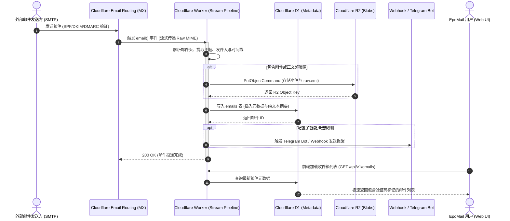
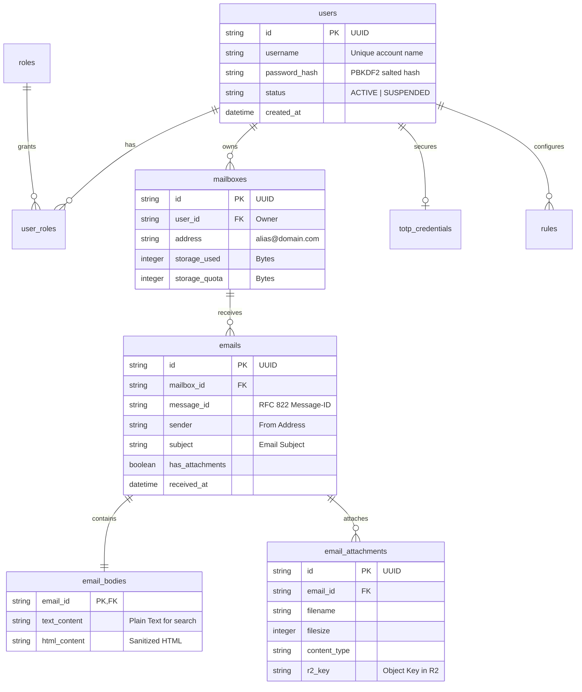
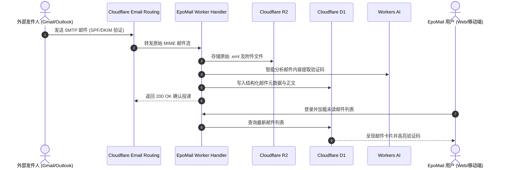
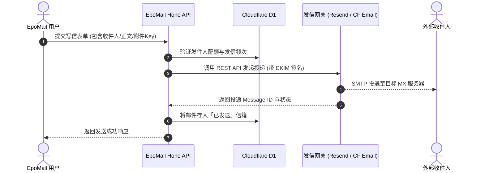

## 🏗️ 整体架构蓝图

EpoMail 采用纯正的 **Serverless 边缘微服务与微数据库架构**。整个系统没有传统物理服务器的概念，所有的计算逻辑、路由中间件、数据持久化与静态资源托管均无缝运行在 **Cloudflare 全球分布式网络**之上。

  

### 端到端邮件入站处理时序图

---

## 💻 1. 计算层：Cloudflare Workers 与 Hono 框架

后端完全运行在 Cloudflare Workers 的 V8 隔离沙箱（V8 Isolates）环境中，具有冷启动毫秒级、零内存泄漏风险与全球就近并发处理的特性。

- **Hono 框架核心赋能**：采用专为 Web 标准打造的极简轻量级 Web 框架 [Hono](https://hono.dev/)，单次请求路由开销低至微秒级。
- **职责分层设计**：
  - `src/hono/`：负责跨域拦截、全局异常捕获（Global Error Handler）、JWT 鉴权中间件以及安全标头注入；
  - `src/api/`：严格按照 RESTful 规范定义接口，负责参数验证与响应打包；
  - `src/service/`：封装复杂的邮件收发状态机、密码哈希比对、TOTP 加密派生以及 RBAC 权限判定；
  - `src/email/`：负责处理由 Cloudflare Email Routing 投递的原生邮件流，进行流式解码与对象存储分发。

---

## 🗄️ 2. 存储层：D1 关系型数据库与实体关系 (ER)

系统使用基于 SQLite 的全球分布式关系型数据库 **Cloudflare D1**。为了实现高内聚、低耦合与未来横向伸缩能力，EpoMail 采用领域微数据库隔离设计，主要实体关系拓扑如下：

### A. 用户与身份域模型 (`USER_DB`)
专门承载身份与访问控制核心模型：
- `users`：用户主表，包含唯一 UUID、用户名、加密密码哈希、账户状态与安全联系信息；
- `roles` 与 `user_roles`：定义 6 级标准 RBAC 角色与其对应的原子权限清单；
- `totp_credentials`：两步验证动态口令机密，密钥经过系统主密钥 AES-GCM 动态加密后密文入库；
- `audit_logs`：全系统关键操作审计流水。

### B. 邮件业务域模型 (`MAIL_DB`)
专注于高性能邮件收发与快速索引：
- `mailboxes`：域名号池与分配关系表，具备配额限制字段；
- `emails`：邮件核心元数据表（Message-ID、发件人、收件人列表、主题、发送时间、状态标志）；
- `email_bodies`：邮件文本与 HTML 内容，支持针对纯文本内容的高性能全词检索；
- `email_attachments`：附件元数据索引表（文件名、文件大小、MIME 类型、R2 Key）；
- `rules`：用户自建的邮件过滤与自动推送信令规则。

---

## 📦 3. 存储层：Cloudflare R2 对象存储与免流量费优势

在邮件系统中，多媒体文件与大型附件往往占据 95% 以上的物理存储空间。

1. **邮件原始报文 (Raw EML) 归档**：
   当邮件到达时，除了解析结构化字段存入 D1，Worker 还会将未经修改的原始 RFC 822 邮件报文直接存入 R2 桶中的 `raw-emails/{uuid}.eml`，确保司法存证与原始内容无损。
2. **附件独立哈希落盘**：
   邮件附件经流式解析后，按照文件的 SHA-256 摘要哈希命名存入 `attachments/{sha256}/{filename}`，天然实现相同文件的去重存储。
3. **安全下载生命周期**：
   前端在请求附件时，API 会生成有效期仅 15 分钟的 R2 签名 URL，直接引导客户端从 Cloudflare 边缘 CDN 下载，完全不占用 Worker 进程内存。

---

## ⚡ 4. 缓存层：Cloudflare KV 的关键职责

Cloudflare Workers KV 具备全球毫秒级读取性能，在 EpoMail 中承担着三大高频实时任务：

1. **用户会话与令牌黑名单 (`session:`)**：记录主动退出登录或权限降级的无效 JWT，实现即时下线；
2. **防爆破限流计数器 (`rate_limit:`)**：统计短时间内的登录失败尝试，超限即自动在 KV 中写入封禁标志位（TTL 自动过期），减轻 D1 数据库查询压力；
3. **每日聚合分析缓存 (`stats_cache:`)**：后台 ECharts 仪表盘需要展示复杂的时间序列统计，系统通过每日 Cron 触发器执行一次全量聚合运算并将图表 JSON 缓存至 KV，使管理后台几乎零延迟秒开。

---

## 🔄 5. 端到端邮件收发流向全景

### 邮件接收链路 (Inbound Flow)

### 邮件发送链路 (Outbound Flow)

