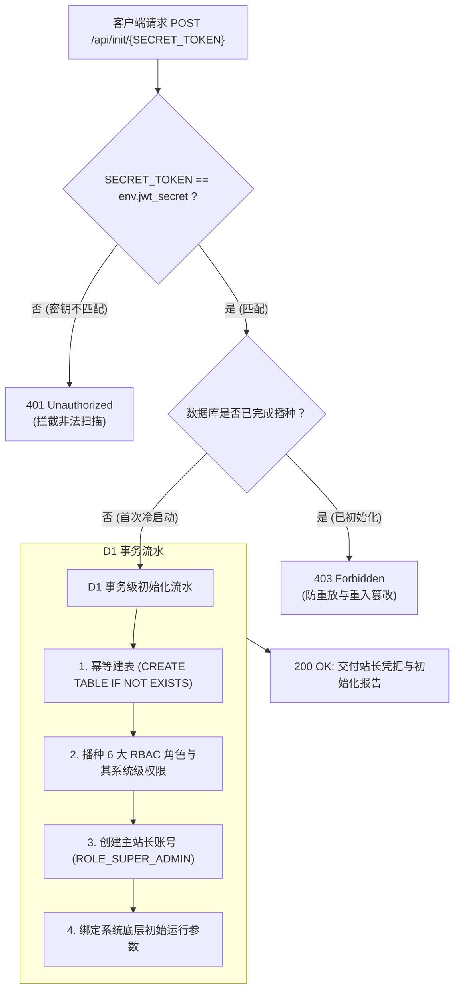

## 🛡️ 为什么需要安全冷启动门禁？

许多传统的开源 Web 系统（如早期 WordPress、各类 Forum 论坛程序）使用明文的 `/install` 或 `/setup` 引导向导页面。这种方式存在致命的安全漏洞：**一旦运维人员完成代码部署但在打开浏览器完成配置前的数分钟内，黑客或扫描机器人极有可能抢先提交表单，夺取全站最高管理员权限**。

EpoMail 创新设计了**“零抢注、无状态、强机密对齐”的冷启动门禁机制**：



---

## ⚡ 执行冷启动初始化

在您成功部署 Cloudflare Worker 后，只需在终端中向您的线上域名发起一次 `POST` 请求：

```bash
# 替换为您的线上域名和此前通过 wrangler secret put 注入的真实 jwt_secret
curl -X POST https://epomail.mybrand.com/api/init/<YOUR_JWT_SECRET>
```

### 成功响应示例
初始化成功后，API 将返回 JSON 格式的初始化报告：

```json
{
  "code": 200,
  "msg": "EpoMail system initialized successfully!",
  "data": {
    "admin_account": "admin@mybrand.com",
    "initial_password": "epomail_admin_temp_pass_2026",
    "roles_seeded": [
      "ROLE_SUPER_ADMIN",
      "ROLE_DOMAIN_ADMIN",
      "ROLE_OPERATOR",
      "ROLE_ADVANCED_USER",
      "ROLE_REGULAR_USER",
      "ROLE_GUEST"
    ],
    "database_status": "ready",
    "timestamp": 1774780800000
  }
}
```

---

## 🔒 核心保障：幂等性与重入防御

1. **不可重入保护 (Non-Reentrancy)**：
   当首次初始化顺利完成后，数据库标记位将永久落盘。此后任何第三方（即便持有正确的 `jwt_secret`）再次访问该接口，系统一律返回 `403 Forbidden: System is already initialized`，任何参数与超级管理员账号均不可被重置覆写。
2. **迁移幂等性 (Idempotent Migrations)**：
   系统建表语句均内置 `CREATE TABLE IF NOT EXISTS` 原生保护。当后续版本迭代升级时，升级函数会通过 `PRAGMA table_info` 预先检查列定义，确保无损增量变更，绝不破坏用户已有数据。

---

## 🔑 首次登录与生产加固指引

1. 打开浏览器访问您的 EpoMail 域名（如 `https://epomail.mybrand.com`）；
2. 使用初始化输出的站长账号 `admin@mybrand.com` 和临时初始密码登入系统；
3. **立即执行密码修改**：
   - 进入右上方「个人资料」设置页面；
   - 修改为至少 12 位、包含大小写字母与特殊符号的强密码；
4. **立即启用 TOTP 两步验证 (2FA)**：
   - 切换到「安全与认证」选项卡；
   - 使用 Google Authenticator、1Password 等验证器 App 扫描二维码并绑定 TOTP；
   - 保存生成的离线应急恢复码（Backup Codes）。
